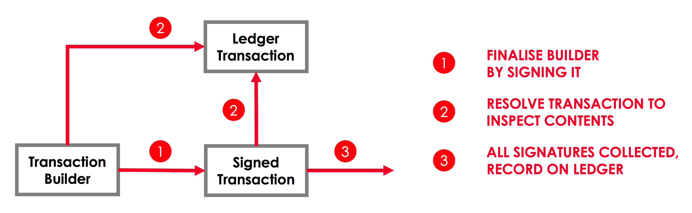

# API: Transactions

<div class="r3-o-note" role="alert"><span>Note: </span>


Before reading this page, you should be familiar with the key concepts of [Transactions](key-concepts-transactions.md).


</div>

## Transaction lifecycle

Between its creation and its final inclusion on the ledger, a transaction will generally occupy one of three states:


* `TransactionBuilder`. A transaction’s initial state. This is the only state during which the transaction is
                        mutable, so we must add all the required components before moving on.


* `SignedTransaction`. The transaction now has one or more digital signatures, making it immutable. This is the
                        transaction type that is passed around to collect additional signatures and that is recorded on the ledger.


* `LedgerTransaction`. The transaction has been “resolved” - for example, its inputs have been converted from
                        references to actual states - allowing the transaction to be fully inspected.


We can visualise the transitions between the three stages as follows:


## Transaction components

A transaction consists of six types of components:


* 1+ states:


    * 0+ input states


    * 0+ output states


    * 0+ reference input states


* 1+ commands


* 0+ attachments


* 0 or 1 time-window


    * A transaction with a time-window must also have a notary


Each component corresponds to a specific class in the Corda API. The following section describes each component class,
                and how it is created.


### Input states

An input state is added to a transaction as a `StateAndRef`, which combines:


* The `ContractState` itself


* A `StateRef` identifying this `ContractState` as the output of a specific transaction


<div><Tabs value={value} aria-label="code tabs"><Tab label="kotlin" /><Tab label="java" /></Tabs>
<TabPanel value={value} index={0}>

```kotlin
val ourStateAndRef: StateAndRef<DummyState> = serviceHub.toStateAndRef<DummyState>(ourStateRef)

```

</TabPanel>
<TabPanel value={value} index={1}>

```java
StateAndRef ourStateAndRef = getServiceHub().toStateAndRef(ourStateRef);

```

</TabPanel>
 [FlowCookbook.kt](https://github.com/corda/corda/blob/release/os/4.3/docs/source/example-code/src/main/kotlin/net/corda/docs/kotlin/FlowCookbook.kt) | [FlowCookbook.java](https://github.com/corda/corda/blob/release/os/4.3/docs/source/example-code/src/main/java/net/corda/docs/java/FlowCookbook.java)


</div>
A `StateRef` uniquely identifies an input state, allowing the notary to mark it as historic. It is made up of:


* The hash of the transaction that generated the state


* The state’s index in the outputs of that transaction


<div><Tabs value={value} aria-label="code tabs"><Tab label="kotlin" /><Tab label="java" /></Tabs>
<TabPanel value={value} index={0}>

```kotlin
val ourStateRef: StateRef = StateRef(SecureHash.sha256("DummyTransactionHash"), 0)

```

</TabPanel>
<TabPanel value={value} index={1}>

```java
StateRef ourStateRef = new StateRef(SecureHash.sha256("DummyTransactionHash"), 0);

```

</TabPanel>
 [FlowCookbook.kt](https://github.com/corda/corda/blob/release/os/4.3/docs/source/example-code/src/main/kotlin/net/corda/docs/kotlin/FlowCookbook.kt) | [FlowCookbook.java](https://github.com/corda/corda/blob/release/os/4.3/docs/source/example-code/src/main/java/net/corda/docs/java/FlowCookbook.java)


</div>
The `StateRef` links an input state back to the transaction that created it. This means that transactions form
                    “chains” linking each input back to an original issuance transaction. This allows nodes verifying the transaction
                    to “walk the chain” and verify that each input was generated through a valid sequence of transactions.


#### Reference input states

<div class="r3-o-warning" role="alert"><span>Warning: </span>


Reference states are only available on Corda networks with a minimum platform version >= 4.


</div>
A reference input state is added to a transaction as a `ReferencedStateAndRef`. A `ReferencedStateAndRef` can be
                        obtained from a `StateAndRef` by calling the `StateAndRef.referenced()` method which returns a `ReferencedStateAndRef`.

<div><Tabs value={value} aria-label="code tabs"><Tab label="kotlin" /><Tab label="java" /></Tabs>
<TabPanel value={value} index={0}>

```kotlin
val referenceState: ReferencedStateAndRef<DummyState> = ourStateAndRef.referenced()

```

</TabPanel>
<TabPanel value={value} index={1}>

```java
ReferencedStateAndRef referenceState = ourStateAndRef.referenced();

```

</TabPanel>
 [FlowCookbook.kt](https://github.com/corda/corda/blob/release/os/4.3/docs/source/example-code/src/main/kotlin/net/corda/docs/kotlin/FlowCookbook.kt) | [FlowCookbook.java](https://github.com/corda/corda/blob/release/os/4.3/docs/source/example-code/src/main/java/net/corda/docs/java/FlowCookbook.java)


</div>
**Handling of update races:**

When using reference states in a transaction, it may be the case that a notarisation failure occurs. This is most likely
                        because the creator of the state (being used as a reference state in your transaction), has just updated it.

Typically, the creator of such reference data will have implemented flows for syndicating the updates out to users.
                        However it is inevitable that there will be a delay between the state being used as a reference being consumed, and the
                        nodes using it receiving the update.

This is where the `WithReferencedStatesFlow` comes in. Given a flow which uses reference states, the
                        `WithReferencedStatesFlow` will execute the the flow as a subFlow. If the flow fails due to a `NotaryError.Conflict`
                        for a reference state, then it will be suspended until the state refs for the reference states are consumed. In this
                        case, a consumption means that:


* the owner of the reference state has updated the state with a valid, notarised transaction


* the owner of the reference state has shared the update with the node attempting to run the flow which uses the
                                reference state


* The node has successfully committed the transaction updating the reference state (and all the dependencies), and
                                added the updated reference state to the vault.


At the point where the transaction updating the state being used as a reference is committed to storage and the vault
                        update occurs, then the `WithReferencedStatesFlow` will wake up and re-execute the provided flow.

<div class="r3-o-warning" role="alert"><span>Warning: </span>


Caution should be taken when using this flow as it facilitates automated re-running of flows which use
                            reference states. The flow using reference states should include checks to ensure that the reference data is
                            reasonable, especially if the economics of the transaction depends upon the data contained within a reference state.


</div>

### Output states

Since a transaction’s output states do not exist until the transaction is committed, they cannot be referenced as the
                    outputs of previous transactions. Instead, we create the desired output states as `ContractState` instances, and
                    add them to the transaction directly:

<div><Tabs value={value} aria-label="code tabs"><Tab label="kotlin" /><Tab label="java" /></Tabs>
<TabPanel value={value} index={0}>

```kotlin
val ourOutputState: DummyState = DummyState()

```

</TabPanel>
<TabPanel value={value} index={1}>

```java
DummyState ourOutputState = new DummyState();

```

</TabPanel>
 [FlowCookbook.kt](https://github.com/corda/corda/blob/release/os/4.3/docs/source/example-code/src/main/kotlin/net/corda/docs/kotlin/FlowCookbook.kt) | [FlowCookbook.java](https://github.com/corda/corda/blob/release/os/4.3/docs/source/example-code/src/main/java/net/corda/docs/java/FlowCookbook.java)


</div>
In cases where an output state represents an update of an input state, we may want to create the output state by basing
                    it on the input state:

<div><Tabs value={value} aria-label="code tabs"><Tab label="kotlin" /><Tab label="java" /></Tabs>
<TabPanel value={value} index={0}>

```kotlin
val ourOtherOutputState: DummyState = ourOutputState.copy(magicNumber = 77)

```

</TabPanel>
<TabPanel value={value} index={1}>

```java
DummyState ourOtherOutputState = ourOutputState.copy(77);

```

</TabPanel>
 [FlowCookbook.kt](https://github.com/corda/corda/blob/release/os/4.3/docs/source/example-code/src/main/kotlin/net/corda/docs/kotlin/FlowCookbook.kt) | [FlowCookbook.java](https://github.com/corda/corda/blob/release/os/4.3/docs/source/example-code/src/main/java/net/corda/docs/java/FlowCookbook.java)


</div>
Before our output state can be added to a transaction, we need to associate it with a contract. We can do this by
                    wrapping the output state in a `StateAndContract`, which combines:


* The `ContractState` representing the output states


* A `String` identifying the contract governing the state


<div><Tabs value={value} aria-label="code tabs"><Tab label="kotlin" /><Tab label="java" /></Tabs>
<TabPanel value={value} index={0}>

```kotlin
val  ourOutput: StateAndContract = StateAndContract(ourOutputState, DummyContract.PROGRAM_ID)

```

</TabPanel>
<TabPanel value={value} index={1}>

```java
StateAndContract ourOutput = new StateAndContract(ourOutputState, DummyContract.PROGRAM_ID);

```

</TabPanel>
 [FlowCookbook.kt](https://github.com/corda/corda/blob/release/os/4.3/docs/source/example-code/src/main/kotlin/net/corda/docs/kotlin/FlowCookbook.kt) | [FlowCookbook.java](https://github.com/corda/corda/blob/release/os/4.3/docs/source/example-code/src/main/java/net/corda/docs/java/FlowCookbook.java)


</div>

### Commands

A command is added to the transaction as a `Command`, which combines:


* A `CommandData` instance indicating the command’s type


* A `List<PublicKey>` representing the command’s required signers


<div><Tabs value={value} aria-label="code tabs"><Tab label="kotlin" /><Tab label="java" /></Tabs>
<TabPanel value={value} index={0}>

```kotlin
val commandData: DummyContract.Commands.Create = DummyContract.Commands.Create()
val ourPubKey: PublicKey = serviceHub.myInfo.legalIdentitiesAndCerts.first().owningKey
val counterpartyPubKey: PublicKey = counterparty.owningKey
val requiredSigners: List<PublicKey> = listOf(ourPubKey, counterpartyPubKey)
val ourCommand: Command<DummyContract.Commands.Create> = Command(commandData, requiredSigners)

```

</TabPanel>
<TabPanel value={value} index={1}>

```java
DummyContract.Commands.Create commandData = new DummyContract.Commands.Create();
PublicKey ourPubKey = getServiceHub().getMyInfo().getLegalIdentitiesAndCerts().get(0).getOwningKey();
PublicKey counterpartyPubKey = counterparty.getOwningKey();
List<PublicKey> requiredSigners = ImmutableList.of(ourPubKey, counterpartyPubKey);
Command<DummyContract.Commands.Create> ourCommand = new Command<>(commandData, requiredSigners);

```

</TabPanel>
 [FlowCookbook.kt](https://github.com/corda/corda/blob/release/os/4.3/docs/source/example-code/src/main/kotlin/net/corda/docs/kotlin/FlowCookbook.kt) | [FlowCookbook.java](https://github.com/corda/corda/blob/release/os/4.3/docs/source/example-code/src/main/java/net/corda/docs/java/FlowCookbook.java)


</div>

### Attachments

Attachments are identified by their hash:

<div><Tabs value={value} aria-label="code tabs"><Tab label="kotlin" /><Tab label="java" /></Tabs>
<TabPanel value={value} index={0}>

```kotlin
val ourAttachment: SecureHash = SecureHash.sha256("DummyAttachment")

```

</TabPanel>
<TabPanel value={value} index={1}>

```java
SecureHash ourAttachment = SecureHash.sha256("DummyAttachment");

```

</TabPanel>
 [FlowCookbook.kt](https://github.com/corda/corda/blob/release/os/4.3/docs/source/example-code/src/main/kotlin/net/corda/docs/kotlin/FlowCookbook.kt) | [FlowCookbook.java](https://github.com/corda/corda/blob/release/os/4.3/docs/source/example-code/src/main/java/net/corda/docs/java/FlowCookbook.java)


</div>
The attachment with the corresponding hash must have been uploaded ahead of time via the node’s RPC interface.


### Time-windows

Time windows represent the period during which the transaction must be notarised. They can have a start and an end
                    time, or be open at either end:

<div><Tabs value={value} aria-label="code tabs"><Tab label="kotlin" /><Tab label="java" /></Tabs>
<TabPanel value={value} index={0}>

```kotlin
val ourTimeWindow: TimeWindow = TimeWindow.between(Instant.MIN, Instant.MAX)
val ourAfter: TimeWindow = TimeWindow.fromOnly(Instant.MIN)
val ourBefore: TimeWindow = TimeWindow.untilOnly(Instant.MAX)

```

</TabPanel>
<TabPanel value={value} index={1}>

```java
TimeWindow ourTimeWindow = TimeWindow.between(Instant.MIN, Instant.MAX);
TimeWindow ourAfter = TimeWindow.fromOnly(Instant.MIN);
TimeWindow ourBefore = TimeWindow.untilOnly(Instant.MAX);

```

</TabPanel>
 [FlowCookbook.kt](https://github.com/corda/corda/blob/release/os/4.3/docs/source/example-code/src/main/kotlin/net/corda/docs/kotlin/FlowCookbook.kt) | [FlowCookbook.java](https://github.com/corda/corda/blob/release/os/4.3/docs/source/example-code/src/main/java/net/corda/docs/java/FlowCookbook.java)


</div>
We can also define a time window as an `Instant` plus/minus a time tolerance (e.g. 30 seconds):

<div><Tabs value={value} aria-label="code tabs"><Tab label="kotlin" /><Tab label="java" /></Tabs>
<TabPanel value={value} index={0}>

```kotlin
val ourTimeWindow2: TimeWindow = TimeWindow.withTolerance(serviceHub.clock.instant(), 30.seconds)

```

</TabPanel>
<TabPanel value={value} index={1}>

```java
TimeWindow ourTimeWindow2 = TimeWindow.withTolerance(getServiceHub().getClock().instant(), Duration.ofSeconds(30));

```

</TabPanel>
 [FlowCookbook.kt](https://github.com/corda/corda/blob/release/os/4.3/docs/source/example-code/src/main/kotlin/net/corda/docs/kotlin/FlowCookbook.kt) | [FlowCookbook.java](https://github.com/corda/corda/blob/release/os/4.3/docs/source/example-code/src/main/java/net/corda/docs/java/FlowCookbook.java)


</div>
Or as a start-time plus a duration:

<div><Tabs value={value} aria-label="code tabs"><Tab label="kotlin" /><Tab label="java" /></Tabs>
<TabPanel value={value} index={0}>

```kotlin
val ourTimeWindow3: TimeWindow = TimeWindow.fromStartAndDuration(serviceHub.clock.instant(), 30.seconds)

```

</TabPanel>
<TabPanel value={value} index={1}>

```java
TimeWindow ourTimeWindow3 = TimeWindow.fromStartAndDuration(getServiceHub().getClock().instant(), Duration.ofSeconds(30));

```

</TabPanel>
 [FlowCookbook.kt](https://github.com/corda/corda/blob/release/os/4.3/docs/source/example-code/src/main/kotlin/net/corda/docs/kotlin/FlowCookbook.kt) | [FlowCookbook.java](https://github.com/corda/corda/blob/release/os/4.3/docs/source/example-code/src/main/java/net/corda/docs/java/FlowCookbook.java)


</div>

## TransactionBuilder


### Creating a builder

The first step when creating a transaction proposal is to instantiate a `TransactionBuilder`.

If the transaction has input states or a time-window, we need to instantiate the builder with a reference to the notary
                    that will notarise the inputs and verify the time-window:

<div><Tabs value={value} aria-label="code tabs"><Tab label="kotlin" /><Tab label="java" /></Tabs>
<TabPanel value={value} index={0}>

```kotlin
val txBuilder: TransactionBuilder = TransactionBuilder(specificNotary)

```

</TabPanel>
<TabPanel value={value} index={1}>

```java
TransactionBuilder txBuilder = new TransactionBuilder(specificNotary);

```

</TabPanel>
 [FlowCookbook.kt](https://github.com/corda/corda/blob/release/os/4.3/docs/source/example-code/src/main/kotlin/net/corda/docs/kotlin/FlowCookbook.kt) | [FlowCookbook.java](https://github.com/corda/corda/blob/release/os/4.3/docs/source/example-code/src/main/java/net/corda/docs/java/FlowCookbook.java)


</div>
We discuss the selection of a notary in [API: Flows](api-flows.md).

If the transaction does not have any input states or a time-window, it does not require a notary, and can be
                    instantiated without one:

<div><Tabs value={value} aria-label="code tabs"><Tab label="kotlin" /><Tab label="java" /></Tabs>
<TabPanel value={value} index={0}>

```kotlin
val txBuilderNoNotary: TransactionBuilder = TransactionBuilder()

```

</TabPanel>
<TabPanel value={value} index={1}>

```java
TransactionBuilder txBuilderNoNotary = new TransactionBuilder();

```

</TabPanel>
 [FlowCookbook.kt](https://github.com/corda/corda/blob/release/os/4.3/docs/source/example-code/src/main/kotlin/net/corda/docs/kotlin/FlowCookbook.kt) | [FlowCookbook.java](https://github.com/corda/corda/blob/release/os/4.3/docs/source/example-code/src/main/java/net/corda/docs/java/FlowCookbook.java)


</div>

### Adding items

The next step is to build up the transaction proposal by adding the desired components.

We can add components to the builder using the `TransactionBuilder.withItems` method:

<div><Tabs value={value} aria-label="code tabs"><Tab label="kotlin" /></Tabs>
<TabPanel value={value} index={0}>

```kotlin
    /** A more convenient way to add items to this transaction that calls the add* methods for you based on type */
    fun withItems(vararg items: Any) = apply {
        for (t in items) {
            when (t) {
                is StateAndRef<*> -> addInputState(t)
                is ReferencedStateAndRef<*> -> addReferenceState(t)
                is SecureHash -> addAttachment(t)
                is TransactionState<*> -> addOutputState(t)
                is StateAndContract -> addOutputState(t.state, t.contract)
                is ContractState -> throw UnsupportedOperationException("Removed as of V1: please use a StateAndContract instead")
                is Command<*> -> addCommand(t)
                is CommandData -> throw IllegalArgumentException("You passed an instance of CommandData, but that lacks the pubkey. You need to wrap it in a Command object first.")
                is TimeWindow -> setTimeWindow(t)
                is PrivacySalt -> setPrivacySalt(t)
                else -> throw IllegalArgumentException("Wrong argument type: ${t.javaClass}")
            }
        }
    }

```

</TabPanel>
 [TransactionBuilder.kt](https://github.com/corda/corda/blob/release/os/4.3/core/src/main/kotlin/net/corda/core/transactions/TransactionBuilder.kt)


</div>
`withItems` takes a `vararg` of objects and adds them to the builder based on their type:


* `StateAndRef` objects are added as input states


* `ReferencedStateAndRef` objects are added as reference input states


* `TransactionState` and `StateAndContract` objects are added as output states


    * Both `TransactionState` and `StateAndContract` are wrappers around a `ContractState` output that link the
                                    output to a specific contract


* `Command` objects are added as commands


* `SecureHash` objects are added as attachments


* A `TimeWindow` object replaces the transaction’s existing `TimeWindow`, if any


Passing in objects of any other type will cause an `IllegalArgumentException` to be thrown.

Here’s an example usage of `TransactionBuilder.withItems`:

<div><Tabs value={value} aria-label="code tabs"><Tab label="kotlin" /><Tab label="java" /></Tabs>
<TabPanel value={value} index={0}>

```kotlin
txBuilder.withItems(
        // Inputs, as ``StateAndRef``s that reference the outputs of previous transactions
        ourStateAndRef,
        // Outputs, as ``StateAndContract``s
        ourOutput,
        // Commands, as ``Command``s
        ourCommand,
        // Attachments, as ``SecureHash``es
        ourAttachment,
        // A time-window, as ``TimeWindow``
        ourTimeWindow
)

```

</TabPanel>
<TabPanel value={value} index={1}>

```java
txBuilder.withItems(
        // Inputs, as ``StateAndRef``s that reference to the outputs of previous transactions
        ourStateAndRef,
        // Outputs, as ``StateAndContract``s
        ourOutput,
        // Commands, as ``Command``s
        ourCommand,
        // Attachments, as ``SecureHash``es
        ourAttachment,
        // A time-window, as ``TimeWindow``
        ourTimeWindow
);

```

</TabPanel>
 [FlowCookbook.kt](https://github.com/corda/corda/blob/release/os/4.3/docs/source/example-code/src/main/kotlin/net/corda/docs/kotlin/FlowCookbook.kt) | [FlowCookbook.java](https://github.com/corda/corda/blob/release/os/4.3/docs/source/example-code/src/main/java/net/corda/docs/java/FlowCookbook.java)


</div>
There are also individual methods for adding components.

Here are the methods for adding inputs and attachments:

<div><Tabs value={value} aria-label="code tabs"><Tab label="kotlin" /><Tab label="java" /></Tabs>
<TabPanel value={value} index={0}>

```kotlin
txBuilder.addInputState(ourStateAndRef)
txBuilder.addAttachment(ourAttachment)

```

</TabPanel>
<TabPanel value={value} index={1}>

```java
txBuilder.addInputState(ourStateAndRef);
txBuilder.addAttachment(ourAttachment);

```

</TabPanel>
 [FlowCookbook.kt](https://github.com/corda/corda/blob/release/os/4.3/docs/source/example-code/src/main/kotlin/net/corda/docs/kotlin/FlowCookbook.kt) | [FlowCookbook.java](https://github.com/corda/corda/blob/release/os/4.3/docs/source/example-code/src/main/java/net/corda/docs/java/FlowCookbook.java)


</div>
An output state can be added as a `ContractState`, contract class name and notary:

<div><Tabs value={value} aria-label="code tabs"><Tab label="kotlin" /><Tab label="java" /></Tabs>
<TabPanel value={value} index={0}>

```kotlin
txBuilder.addOutputState(ourOutputState, DummyContract.PROGRAM_ID, specificNotary)

```

</TabPanel>
<TabPanel value={value} index={1}>

```java
txBuilder.addOutputState(ourOutputState, DummyContract.PROGRAM_ID, specificNotary);

```

</TabPanel>
 [FlowCookbook.kt](https://github.com/corda/corda/blob/release/os/4.3/docs/source/example-code/src/main/kotlin/net/corda/docs/kotlin/FlowCookbook.kt) | [FlowCookbook.java](https://github.com/corda/corda/blob/release/os/4.3/docs/source/example-code/src/main/java/net/corda/docs/java/FlowCookbook.java)


</div>
We can also leave the notary field blank, in which case the transaction’s default notary is used:

<div><Tabs value={value} aria-label="code tabs"><Tab label="kotlin" /><Tab label="java" /></Tabs>
<TabPanel value={value} index={0}>

```kotlin
txBuilder.addOutputState(ourOutputState, DummyContract.PROGRAM_ID)

```

</TabPanel>
<TabPanel value={value} index={1}>

```java
txBuilder.addOutputState(ourOutputState, DummyContract.PROGRAM_ID);

```

</TabPanel>
 [FlowCookbook.kt](https://github.com/corda/corda/blob/release/os/4.3/docs/source/example-code/src/main/kotlin/net/corda/docs/kotlin/FlowCookbook.kt) | [FlowCookbook.java](https://github.com/corda/corda/blob/release/os/4.3/docs/source/example-code/src/main/java/net/corda/docs/java/FlowCookbook.java)


</div>
Or we can add the output state as a `TransactionState`, which already specifies the output’s contract and notary:

<div><Tabs value={value} aria-label="code tabs"><Tab label="kotlin" /><Tab label="java" /></Tabs>
<TabPanel value={value} index={0}>

```kotlin
val txState: TransactionState<DummyState> = TransactionState(ourOutputState, DummyContract.PROGRAM_ID, specificNotary)

```

</TabPanel>
<TabPanel value={value} index={1}>

```java
TransactionState txState = new TransactionState(ourOutputState, DummyContract.PROGRAM_ID, specificNotary);

```

</TabPanel>
 [FlowCookbook.kt](https://github.com/corda/corda/blob/release/os/4.3/docs/source/example-code/src/main/kotlin/net/corda/docs/kotlin/FlowCookbook.kt) | [FlowCookbook.java](https://github.com/corda/corda/blob/release/os/4.3/docs/source/example-code/src/main/java/net/corda/docs/java/FlowCookbook.java)


</div>
Commands can be added as a `Command`:

<div><Tabs value={value} aria-label="code tabs"><Tab label="kotlin" /><Tab label="java" /></Tabs>
<TabPanel value={value} index={0}>

```kotlin
txBuilder.addCommand(ourCommand)

```

</TabPanel>
<TabPanel value={value} index={1}>

```java
txBuilder.addCommand(ourCommand);

```

</TabPanel>
 [FlowCookbook.kt](https://github.com/corda/corda/blob/release/os/4.3/docs/source/example-code/src/main/kotlin/net/corda/docs/kotlin/FlowCookbook.kt) | [FlowCookbook.java](https://github.com/corda/corda/blob/release/os/4.3/docs/source/example-code/src/main/java/net/corda/docs/java/FlowCookbook.java)


</div>
Or as `CommandData` and a `vararg PublicKey`:

<div><Tabs value={value} aria-label="code tabs"><Tab label="kotlin" /><Tab label="java" /></Tabs>
<TabPanel value={value} index={0}>

```kotlin
txBuilder.addCommand(commandData, ourPubKey, counterpartyPubKey)

```

</TabPanel>
<TabPanel value={value} index={1}>

```java
txBuilder.addCommand(commandData, ourPubKey, counterpartyPubKey);

```

</TabPanel>
 [FlowCookbook.kt](https://github.com/corda/corda/blob/release/os/4.3/docs/source/example-code/src/main/kotlin/net/corda/docs/kotlin/FlowCookbook.kt) | [FlowCookbook.java](https://github.com/corda/corda/blob/release/os/4.3/docs/source/example-code/src/main/java/net/corda/docs/java/FlowCookbook.java)


</div>
For the time-window, we can set a time-window directly:

<div><Tabs value={value} aria-label="code tabs"><Tab label="kotlin" /><Tab label="java" /></Tabs>
<TabPanel value={value} index={0}>

```kotlin
txBuilder.setTimeWindow(ourTimeWindow)

```

</TabPanel>
<TabPanel value={value} index={1}>

```java
txBuilder.setTimeWindow(ourTimeWindow);

```

</TabPanel>
 [FlowCookbook.kt](https://github.com/corda/corda/blob/release/os/4.3/docs/source/example-code/src/main/kotlin/net/corda/docs/kotlin/FlowCookbook.kt) | [FlowCookbook.java](https://github.com/corda/corda/blob/release/os/4.3/docs/source/example-code/src/main/java/net/corda/docs/java/FlowCookbook.java)


</div>
Or define the time-window as a time plus a duration (e.g. 45 seconds):

<div><Tabs value={value} aria-label="code tabs"><Tab label="kotlin" /><Tab label="java" /></Tabs>
<TabPanel value={value} index={0}>

```kotlin
txBuilder.setTimeWindow(serviceHub.clock.instant(), 45.seconds)

```

</TabPanel>
<TabPanel value={value} index={1}>

```java
txBuilder.setTimeWindow(getServiceHub().getClock().instant(), Duration.ofSeconds(45));

```

</TabPanel>
 [FlowCookbook.kt](https://github.com/corda/corda/blob/release/os/4.3/docs/source/example-code/src/main/kotlin/net/corda/docs/kotlin/FlowCookbook.kt) | [FlowCookbook.java](https://github.com/corda/corda/blob/release/os/4.3/docs/source/example-code/src/main/java/net/corda/docs/java/FlowCookbook.java)


</div>

### Signing the builder

Once the builder is ready, we finalize it by signing it and converting it into a `SignedTransaction`.

We can either sign with our legal identity key:

<div><Tabs value={value} aria-label="code tabs"><Tab label="kotlin" /><Tab label="java" /></Tabs>
<TabPanel value={value} index={0}>

```kotlin
val onceSignedTx: SignedTransaction = serviceHub.signInitialTransaction(txBuilder)

```

</TabPanel>
<TabPanel value={value} index={1}>

```java
SignedTransaction onceSignedTx = getServiceHub().signInitialTransaction(txBuilder);

```

</TabPanel>
 [FlowCookbook.kt](https://github.com/corda/corda/blob/release/os/4.3/docs/source/example-code/src/main/kotlin/net/corda/docs/kotlin/FlowCookbook.kt) | [FlowCookbook.java](https://github.com/corda/corda/blob/release/os/4.3/docs/source/example-code/src/main/java/net/corda/docs/java/FlowCookbook.java)


</div>
Or we can also choose to use another one of our public keys:

<div><Tabs value={value} aria-label="code tabs"><Tab label="kotlin" /><Tab label="java" /></Tabs>
<TabPanel value={value} index={0}>

```kotlin
val otherIdentity: PartyAndCertificate = serviceHub.keyManagementService.freshKeyAndCert(ourIdentityAndCert, false)
val onceSignedTx2: SignedTransaction = serviceHub.signInitialTransaction(txBuilder, otherIdentity.owningKey)

```

</TabPanel>
<TabPanel value={value} index={1}>

```java
PartyAndCertificate otherIdentity = getServiceHub().getKeyManagementService().freshKeyAndCert(getOurIdentityAndCert(), false);
SignedTransaction onceSignedTx2 = getServiceHub().signInitialTransaction(txBuilder, otherIdentity.getOwningKey());

```

</TabPanel>
 [FlowCookbook.kt](https://github.com/corda/corda/blob/release/os/4.3/docs/source/example-code/src/main/kotlin/net/corda/docs/kotlin/FlowCookbook.kt) | [FlowCookbook.java](https://github.com/corda/corda/blob/release/os/4.3/docs/source/example-code/src/main/java/net/corda/docs/java/FlowCookbook.java)


</div>
Either way, the outcome of this process is to create an immutable `SignedTransaction` with our signature over it.


## SignedTransaction

A `SignedTransaction` is a combination of:


* An immutable transaction


* A list of signatures over that transaction


<div><Tabs value={value} aria-label="code tabs"><Tab label="kotlin" /></Tabs>
<TabPanel value={value} index={0}>

```kotlin
@KeepForDJVM
@CordaSerializable
data class SignedTransaction(val txBits: SerializedBytes<CoreTransaction>,
                             override val sigs: List<TransactionSignature>
) : TransactionWithSignatures {

```

</TabPanel>
 [SignedTransaction.kt](https://github.com/corda/corda/blob/release/os/4.3/core/src/main/kotlin/net/corda/core/transactions/SignedTransaction.kt)


</div>
Before adding our signature to the transaction, we’ll want to verify both the transaction’s contents and the
                transaction’s signatures.


### Verifying the transaction’s contents

If a transaction has inputs, we need to retrieve all the states in the transaction’s dependency chain before we can
                    verify the transaction’s contents. This is because the transaction is only valid if its dependency chain is also valid.
                    We do this by requesting any states in the chain that our node doesn’t currently have in its local storage from the
                    proposer(s) of the transaction. This process is handled by a built-in flow called `ReceiveTransactionFlow`.
                    See [API: Flows](api-flows.md) for more details.

We can now verify the transaction’s contents to ensure that it satisfies the contracts of all the transaction’s input
                    and output states:

<div><Tabs value={value} aria-label="code tabs"><Tab label="kotlin" /><Tab label="java" /></Tabs>
<TabPanel value={value} index={0}>

```kotlin
twiceSignedTx.verify(serviceHub)

```

</TabPanel>
<TabPanel value={value} index={1}>

```java
twiceSignedTx.verify(getServiceHub());

```

</TabPanel>
 [FlowCookbook.kt](https://github.com/corda/corda/blob/release/os/4.3/docs/source/example-code/src/main/kotlin/net/corda/docs/kotlin/FlowCookbook.kt) | [FlowCookbook.java](https://github.com/corda/corda/blob/release/os/4.3/docs/source/example-code/src/main/java/net/corda/docs/java/FlowCookbook.java)


</div>
Checking that the transaction meets the contract constraints is only part of verifying the transaction’s contents. We
                    will usually also want to perform our own additional validation of the transaction contents before signing, to ensure
                    that the transaction proposal represents an agreement we wish to enter into.

However, the `SignedTransaction` holds its inputs as `StateRef` instances, and its attachments as `SecureHash`
                    instances, which do not provide enough information to properly validate the transaction’s contents. We first need to
                    resolve the `StateRef` and `SecureHash` instances into actual `ContractState` and `Attachment` instances, which
                    we can then inspect.

We achieve this by using the `ServiceHub` to convert the `SignedTransaction` into a `LedgerTransaction`:

<div><Tabs value={value} aria-label="code tabs"><Tab label="kotlin" /><Tab label="java" /></Tabs>
<TabPanel value={value} index={0}>

```kotlin
val ledgerTx: LedgerTransaction = twiceSignedTx.toLedgerTransaction(serviceHub)

```

</TabPanel>
<TabPanel value={value} index={1}>

```java
LedgerTransaction ledgerTx = twiceSignedTx.toLedgerTransaction(getServiceHub());

```

</TabPanel>
 [FlowCookbook.kt](https://github.com/corda/corda/blob/release/os/4.3/docs/source/example-code/src/main/kotlin/net/corda/docs/kotlin/FlowCookbook.kt) | [FlowCookbook.java](https://github.com/corda/corda/blob/release/os/4.3/docs/source/example-code/src/main/java/net/corda/docs/java/FlowCookbook.java)


</div>
We can now perform our additional verification. Here’s a simple example:

<div><Tabs value={value} aria-label="code tabs"><Tab label="kotlin" /><Tab label="java" /></Tabs>
<TabPanel value={value} index={0}>

```kotlin
val outputState: DummyState = ledgerTx.outputsOfType<DummyState>().single()
if (outputState.magicNumber == 777) {
    // ``FlowException`` is a special exception type. It will be
    // propagated back to any counterparty flows waiting for a
    // message from this flow, notifying them that the flow has
    // failed.
    throw FlowException("We expected a magic number of 777.")
}

```

</TabPanel>
<TabPanel value={value} index={1}>

```java
DummyState outputState = ledgerTx.outputsOfType(DummyState.class).get(0);
if (outputState.getMagicNumber() != 777) {
    // ``FlowException`` is a special exception type. It will be
    // propagated back to any counterparty flows waiting for a
    // message from this flow, notifying them that the flow has
    // failed.
    throw new FlowException("We expected a magic number of 777.");
}

```

</TabPanel>
 [FlowCookbook.kt](https://github.com/corda/corda/blob/release/os/4.3/docs/source/example-code/src/main/kotlin/net/corda/docs/kotlin/FlowCookbook.kt) | [FlowCookbook.java](https://github.com/corda/corda/blob/release/os/4.3/docs/source/example-code/src/main/java/net/corda/docs/java/FlowCookbook.java)


</div>

### Verifying the transaction’s signatures

Aside from verifying that the transaction’s contents are valid, we also need to check that the signatures are valid. A
                    valid signature over the hash of the transaction prevents tampering.

We can verify that all the transaction’s required signatures are present and valid as follows:

<div><Tabs value={value} aria-label="code tabs"><Tab label="kotlin" /><Tab label="java" /></Tabs>
<TabPanel value={value} index={0}>

```kotlin
fullySignedTx.verifyRequiredSignatures()

```

</TabPanel>
<TabPanel value={value} index={1}>

```java
fullySignedTx.verifyRequiredSignatures();

```

</TabPanel>
 [FlowCookbook.kt](https://github.com/corda/corda/blob/release/os/4.3/docs/source/example-code/src/main/kotlin/net/corda/docs/kotlin/FlowCookbook.kt) | [FlowCookbook.java](https://github.com/corda/corda/blob/release/os/4.3/docs/source/example-code/src/main/java/net/corda/docs/java/FlowCookbook.java)


</div>
However, we’ll often want to verify the transaction’s existing signatures before all of them have been collected. For
                    this we can use `SignedTransaction.verifySignaturesExcept`, which takes a `vararg` of the public keys for
                    which the signatures are allowed to be missing:

<div><Tabs value={value} aria-label="code tabs"><Tab label="kotlin" /><Tab label="java" /></Tabs>
<TabPanel value={value} index={0}>

```kotlin
onceSignedTx.verifySignaturesExcept(counterpartyPubKey)

```

</TabPanel>
<TabPanel value={value} index={1}>

```java
onceSignedTx.verifySignaturesExcept(counterpartyPubKey);

```

</TabPanel>
 [FlowCookbook.kt](https://github.com/corda/corda/blob/release/os/4.3/docs/source/example-code/src/main/kotlin/net/corda/docs/kotlin/FlowCookbook.kt) | [FlowCookbook.java](https://github.com/corda/corda/blob/release/os/4.3/docs/source/example-code/src/main/java/net/corda/docs/java/FlowCookbook.java)


</div>
There is also an overload of `SignedTransaction.verifySignaturesExcept`, which takes a `Collection` of the
                    public keys for which the signatures are allowed to be missing:

<div><Tabs value={value} aria-label="code tabs"><Tab label="kotlin" /><Tab label="java" /></Tabs>
<TabPanel value={value} index={0}>

```kotlin
onceSignedTx.verifySignaturesExcept(listOf(counterpartyPubKey))

```

</TabPanel>
<TabPanel value={value} index={1}>

```java
onceSignedTx.verifySignaturesExcept(singletonList(counterpartyPubKey));

```

</TabPanel>
 [FlowCookbook.kt](https://github.com/corda/corda/blob/release/os/4.3/docs/source/example-code/src/main/kotlin/net/corda/docs/kotlin/FlowCookbook.kt) | [FlowCookbook.java](https://github.com/corda/corda/blob/release/os/4.3/docs/source/example-code/src/main/java/net/corda/docs/java/FlowCookbook.java)


</div>
If the transaction is missing any signatures without the corresponding public keys being passed in, a
                    `SignaturesMissingException` is thrown.

We can also choose to simply verify the signatures that are present:

<div><Tabs value={value} aria-label="code tabs"><Tab label="kotlin" /><Tab label="java" /></Tabs>
<TabPanel value={value} index={0}>

```kotlin
twiceSignedTx.checkSignaturesAreValid()

```

</TabPanel>
<TabPanel value={value} index={1}>

```java
twiceSignedTx.checkSignaturesAreValid();

```

</TabPanel>
 [FlowCookbook.kt](https://github.com/corda/corda/blob/release/os/4.3/docs/source/example-code/src/main/kotlin/net/corda/docs/kotlin/FlowCookbook.kt) | [FlowCookbook.java](https://github.com/corda/corda/blob/release/os/4.3/docs/source/example-code/src/main/java/net/corda/docs/java/FlowCookbook.java)


</div>
Be very careful, however - this function neither guarantees that the signatures that are present are required, nor
                    checks whether any signatures are missing.


### Signing the transaction

Once we are satisfied with the contents and existing signatures over the transaction, we add our signature to the
                    `SignedTransaction` to indicate that we approve the transaction.

We can sign using our legal identity key, as follows:

<div><Tabs value={value} aria-label="code tabs"><Tab label="kotlin" /><Tab label="java" /></Tabs>
<TabPanel value={value} index={0}>

```kotlin
val twiceSignedTx: SignedTransaction = serviceHub.addSignature(onceSignedTx)

```

</TabPanel>
<TabPanel value={value} index={1}>

```java
SignedTransaction twiceSignedTx = getServiceHub().addSignature(onceSignedTx);

```

</TabPanel>
 [FlowCookbook.kt](https://github.com/corda/corda/blob/release/os/4.3/docs/source/example-code/src/main/kotlin/net/corda/docs/kotlin/FlowCookbook.kt) | [FlowCookbook.java](https://github.com/corda/corda/blob/release/os/4.3/docs/source/example-code/src/main/java/net/corda/docs/java/FlowCookbook.java)


</div>
Or we can choose to sign using another one of our public keys:

<div><Tabs value={value} aria-label="code tabs"><Tab label="kotlin" /><Tab label="java" /></Tabs>
<TabPanel value={value} index={0}>

```kotlin
val twiceSignedTx2: SignedTransaction = serviceHub.addSignature(onceSignedTx, otherIdentity2.owningKey)

```

</TabPanel>
<TabPanel value={value} index={1}>

```java
SignedTransaction twiceSignedTx2 = getServiceHub().addSignature(onceSignedTx, otherIdentity2.getOwningKey());

```

</TabPanel>
 [FlowCookbook.kt](https://github.com/corda/corda/blob/release/os/4.3/docs/source/example-code/src/main/kotlin/net/corda/docs/kotlin/FlowCookbook.kt) | [FlowCookbook.java](https://github.com/corda/corda/blob/release/os/4.3/docs/source/example-code/src/main/java/net/corda/docs/java/FlowCookbook.java)


</div>
We can also generate a signature over the transaction without adding it to the transaction directly.

We can do this with our legal identity key:

<div><Tabs value={value} aria-label="code tabs"><Tab label="kotlin" /><Tab label="java" /></Tabs>
<TabPanel value={value} index={0}>

```kotlin
val sig: TransactionSignature = serviceHub.createSignature(onceSignedTx)

```

</TabPanel>
<TabPanel value={value} index={1}>

```java
TransactionSignature sig = getServiceHub().createSignature(onceSignedTx);

```

</TabPanel>
 [FlowCookbook.kt](https://github.com/corda/corda/blob/release/os/4.3/docs/source/example-code/src/main/kotlin/net/corda/docs/kotlin/FlowCookbook.kt) | [FlowCookbook.java](https://github.com/corda/corda/blob/release/os/4.3/docs/source/example-code/src/main/java/net/corda/docs/java/FlowCookbook.java)


</div>
Or using another one of our public keys:

<div><Tabs value={value} aria-label="code tabs"><Tab label="kotlin" /><Tab label="java" /></Tabs>
<TabPanel value={value} index={0}>

```kotlin
val sig2: TransactionSignature = serviceHub.createSignature(onceSignedTx, otherIdentity2.owningKey)

```

</TabPanel>
<TabPanel value={value} index={1}>

```java
TransactionSignature sig2 = getServiceHub().createSignature(onceSignedTx, otherIdentity2.getOwningKey());

```

</TabPanel>
 [FlowCookbook.kt](https://github.com/corda/corda/blob/release/os/4.3/docs/source/example-code/src/main/kotlin/net/corda/docs/kotlin/FlowCookbook.kt) | [FlowCookbook.java](https://github.com/corda/corda/blob/release/os/4.3/docs/source/example-code/src/main/java/net/corda/docs/java/FlowCookbook.java)


</div>

### Notarising and recording

Notarising and recording a transaction is handled by a built-in flow called `FinalityFlow`. See [API: Flows](api-flows.md) for
                    more details.


